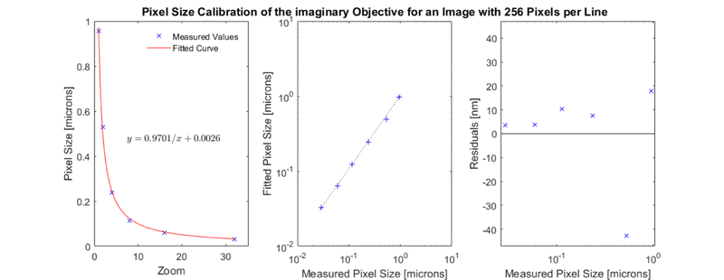

CalibrationPixelSize
=======================================

Store pixel size calibration


Usage
----------------------------------------------------------

```matlab
OBJ = CalibrationPixelSize(ZOOM, PXSIZE, IMGSIZE, OBJECTIVE, DATE,
    NAME, PERSON, FUNRAW)
```


Arguments
----------------------------------------------------------

   + `ZOOM` is a vector of zoom values at which the pixel size is known.
   + `PXSIZE` is a vector of pixel sizes at the given zoom values.
   + `IMGSIZE` is a scalar integer specifying the number of pixels in the calibration images.
   + `OBJECTIVE` is the objective that the calibration is for.
   + `DATE` is the date the calibration was performed.
   + `NAME` is the name of the calibration.
   + `PERSON` is the person who performed the calibration.
   + `FUNRAW` is an unparameterised function handle describing the relationship between zoom and pixel size.


Details
----------------------------------------------------------

`CalibrationPixelSize` contains a calibration relating a given microscope zoom factor to a known physical pixel size (in units of distance) for a given objective.


See Also
----------------------------------------------------------

   + [`CalibrationPixelSize` class documentation](matlab:doc('CalibrationPixelSize'))
   + [`Metadata` class documentation](matlab:doc('Metadata'))
   + [`Metadata` quick start guide](./id_md_Metadata.html)
   + [`RawImg` class documentation](matlab:doc('RawImg'))
   + [`RawImg` quick start guide](./id_ri.html)


Examples
----------------------------------------------------------

<h3>Create a <tt>CalibrationPixelSize</tt> object</h3>

The following example will illustrate the process of creating a `CalibrationPixelSize` object.  Normally this process only needs to be done once per objective/microscope combination.

```matlab
% Specify some zoom values
zoom = 2.^(0:5)

% Specify some values for pixel size at the defined zoom, with added noise
pxSize = (1./zoom).*(1 + 0.05*randn(1, numel(zoom)))

% Specify the original number of pixels in the calibration images
imgSize = 256;

% Specify some other aspects of the calibration
objective = 'imaginary';
date = 'yesterday';
name = 'test calibration';
person = 'Dr Who';
funRaw = @CalibrationPixelSize.funRawHyperbola;

% Call the CalibrationPixelSize constructor
cal001 = CalibrationPixelSize(zoom, pxSize, imgSize, objective, date, ...
    name, person, funRaw)

% Show a plot of the calibration. (Note: your image may differ due to the
% random data used to generate the calibration)
cal001.plot();
```

```text
zoom =
     1     2     4     8    16    32
pxSize =
    0.9548    0.5306    0.2376    0.1137    0.0596    0.0294
cal001 =
  CalibrationPixelSize with properties:

         date: 'yesterday'
       funRaw: @CalibrationPixelSize.funRawHyperbola
      imgSize: 256
         name: 'test calibration'
    objective: 'imaginary'
       person: 'Dr Who'
    pixelSize: [6×1 double]
         zoom: [6×1 double]

```


<h3>Saving a <tt>CalibrationPixelSize</tt> object</h3>

```matlab
% Save the calibration
cal001.save('cal001.mat');
```
<h3>Loading a <tt>CalibrationPixelSize</tt> object</h3>

```matlab
% Load the calibration
cal001_reloaded = CalibrationPixelSize.load('cal001.mat')

% Check that the loaded calibration is the same as the one we saved
isEqual = cal001 == cal001_reloaded
```

```text
cal001_reloaded =
  CalibrationPixelSize with properties:

         date: 'yesterday'
       funRaw: @CalibrationPixelSize.funRawHyperbola
      imgSize: 256
         name: 'test calibration'
    objective: 'imaginary'
       person: 'Dr Who'
    pixelSize: [6×1 double]
         zoom: [6×1 double]
isEqual =
  logical
   1

```
<h3>Creating a 'dummy' <tt>CalibrationPixelSize</tt> object</h3>

The following example will illustrate the process of creating a 'dummy' `CalibrationPixelSize` object.  This process is needed to specify the pixel size for images that do not possess the necessary metadata to create their own calibration (as normally happens with `BioFormats` images) or use a calibration based on the zoom value (as normally happens with `SCIM_Tif` images).

```matlab
% Specify the desired pixel size
pxSizeImg = 1.234; % um

% Specify the image size.  This is important to set correctly, because the
% pixel size for an image depends on both the calibration and the image
% size.  For example, for the same calibration, a 128 x 128 pixel image
% will have a pixel size two times larger than a 256 x 256 pixel image.
imgSizeDummy = 256;

% Specify the remaining information
zoomDummy = [1 100];
pxSizeDummy = pxSizeImg.*ones(size(zoomDummy));
objectiveDummy = 'dummy';
dateDummy = 'dummy';
nameDummy = 'dummy';
personDummy = 'dummy';
funRawDummy = @CalibrationPixelSize.funRawDummy;

% Create the calibration object
calDummy = CalibrationPixelSize(zoomDummy, pxSizeDummy, imgSizeDummy, ...
    objectiveDummy, dateDummy, nameDummy, personDummy, funRawDummy);

% Show the pixel size that will be returned
zoom05 = 5;
pxSize05_1 = calDummy.calc_pixel_size(zoom05, imgSizeDummy)
```

```text
pxSize05_1 =
    1.2340

```
```matlab
% Note that the pixel size is different for different image sizes
pxSize05_2 = calDummy.calc_pixel_size(zoom05, imgSizeDummy/2)
```

```text
pxSize05_2 =
    2.4680

```
```matlab
% For dummy calibrations, the pixel size is the same for all zoom values
zoomRange = 1:10:100;
pxSize05_range = calDummy.calc_pixel_size(zoomRange, imgSizeDummy)
```

```text
pxSize05_range =
  Columns 1 through 7
    1.2340    1.2340    1.2340    1.2340    1.2340    1.2340    1.2340
  Columns 8 through 10
    1.2340    1.2340    1.2340

```

---
[Home](./index.html)
