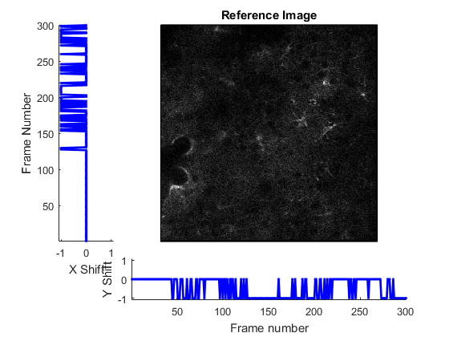
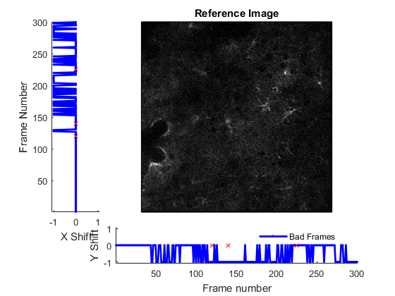

Motion Correction
=======================================

Motion correction is designed to correct for motion artefacts in the raw images that often result from movement of the sample.  This may occur through microscope drift or movement of the sample (e.g. animal) itself.


See Also
----------------------------------------------------------

   + [Motion correction utility function documentation](matlab:doc('utils.motion_correct'))
   + [`RawImg` quick start guide](./id_ri.html)


Examples
----------------------------------------------------------

The following examples require the sample images and other files, which can be downloaded manually, from the University of Zurich website ([http://www.pharma.uzh.ch/en/research/functionalimaging/CHIPS.html](http://www.pharma.uzh.ch/en/research/functionalimaging/CHIPS.html)), or automatically, by running the function `utils.download_example_imgs()`.

<h3>Prepare a <tt>RawImg</tt> for use in these examples</h3>

```matlab
% Prepare a rawImg for use in these examples
fnRawImg = fullfile(utils.CHIPS_rootdir, 'tests', 'res', ...
    'cellscan_scim.tif');
channels = struct('Ca_Cyto_Astro', 1);
fnCalibration = fullfile(utils.CHIPS_rootdir, 'tests', 'res', ...
    'calibration_dummy.mat');
calibration = CalibrationPixelSize.load(fnCalibration);
rawImg = SCIM_Tif(fnRawImg, channels, calibration);
```

```text
Opening cellscan_scim.tif: 100% [==================================]

```
<h3>Motion correct a scalar <tt>RawImg</tt> object</h3>

```matlab
% Make a copy of the RawImg object so we can reuse the original later
ri001 = copy(rawImg);

% Motion correct a scalar RawImg object, showing a plot as output
ri001.motion_correct('doPlot', true);
```

```text
Correcting motion: 100% [==========================================]

```


<h3>Motion correct using custom parameters</h3>

```matlab
% Motion correct using custom parameters
ri002 = copy(rawImg);
ri002.motion_correct('minCorr', 0.843, 'doPlot', true);
```

```text
Correcting motion:  12% [=====>                                    ]
Warning: Correlation is 0.843 and lower than the specified minimal correlation 0.843.
> In utils.convnfft.calcShifts>pmatch (line 159)
  In utils.convnfft.calcShifts>pattern_matching (line 115)
  In parallel_function>make_general_channel/channel_general (line 914)
  In remoteParallelFunction (line 38)
Correcting motion:  51% [=====================>                    ]
Warning: Correlation is 0.843 and lower than the specified minimal correlation 0.843.
> In utils.convnfft.calcShifts>pmatch (line 159)
  In utils.convnfft.calcShifts>pattern_matching (line 115)
  In parallel_function>make_general_channel/channel_general (line 914)
  In remoteParallelFunction (line 38)
Correcting motion:  81% [=================================>        ]
Warning: Correlation is 0.843 and lower than the specified minimal correlation 0.843.
> In utils.convnfft.calcShifts>pmatch (line 159)
  In utils.convnfft.calcShifts>pattern_matching (line 115)
  In parallel_function>make_general_channel/channel_general (line 914)
  In remoteParallelFunction (line 38)
Correcting motion: 100% [==========================================]

```


<h3>Motion correct a <tt>RawImg</tt> object array (in parallel)</h3>

```matlab
% Create a RawImg array
riArray(1:3) = copy(rawImg);
riArray = copy(riArray);

% Motion correct a RawImg object array (in parallel)
% This code requires the Parallel Computing Toolbox to run in parallel
riArray = riArray.motion_correct('useParallel', true);
isMC_array = [riArray(:).isMotionCorrected]
```

```text
Motion correcting array: 100% [====================================]
isMC_array =
  1×3 logical array
   1   1   1

```
[Home](./index.html)

