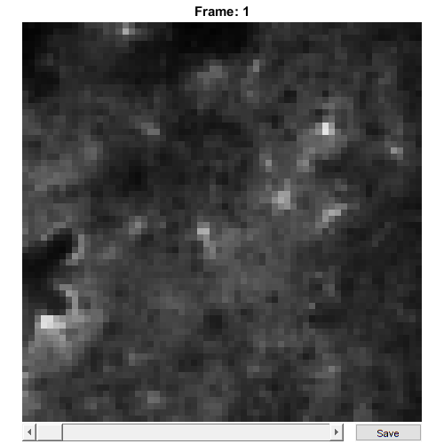

BioFormats
=======================================

Store raw data from BioFormats images


Usage
----------------------------------------------------------

```matlab
OBJ = BioFormats(FILENAME, CHS, CAL)
```


Arguments
----------------------------------------------------------

   + `FILENAME` is the original filename (including the path) of this `BioFormats` object.
   + `CHS` is a scalar structure that contains information about the meaning of the image channels.
   + `CAL` is a scalar `CalibrationPixelSize` object.


Details
----------------------------------------------------------

`BioFormats` objects are used to contain all raw image data and metadata from Bio-Formats Tif images.   This class relies on existing code from the Bio-Formats library.  For more information, please visit [http://www.openmicroscopy.org/site/products/bio-formats](http://www.openmicroscopy.org/site/products/bio-formats).


See Also
----------------------------------------------------------

   + [`RawImg` class documentation](matlab:doc('RawImg'))
   + [`Metadata` class documentation](matlab:doc('Metadata'))
   + [`Metadata` quick start guide](./id_md_Metadata.html)
   + [`CalibrationPixelSize` class documentation](matlab:doc('CalibrationPixelSize'))
   + [`CalibrationPixelSize` quick start guide](./id_md_Calibration.html)


Examples
----------------------------------------------------------

The following examples require the sample images and other files, which can be downloaded manually, from the University of Zurich website ([http://www.pharma.uzh.ch/en/research/functionalimaging/CHIPS.html](http://www.pharma.uzh.ch/en/research/functionalimaging/CHIPS.html)), or automatically, by running the function `utils.download_example_imgs()`.

In addition, loading Bio-Formats images requires prior installation of the Bio-Formats Java library, which can be downloaded manually from the Open Microscopy Environment website (['http://www.openmicroscopy.org/site/products/bio-formats]('http://www.openmicroscopy.org/site/products/bio-formats)), or automatically by running the function `utils.install_bfmatlab()`.

<h3>Create a <tt>BioFormats</tt> object interactively</h3>

The following example will illustrate the process of creating a `BioFormats` object interactively.  It is possible to do so by using the `from_files()` method, rather than the constructor (as is demonstrated in this section).

```matlab
% Call the BioFormats constructor
bf001 = BioFormats()
```
Use the interactive dialogue box to select the raw image file `cellscan_ome_tiff.ome.tif`.


The next stage is to define the 'meaning' of the image channels.  The first channel represents a cytosolic calcium sensor expressed in astrocytes.  Press three and then enter to complete the selection.


```text
----- What is shown on channel 1? -----
```

```text
  >> 0) <blank>
     1) blood_plasma
     2) blood_rbcs
     3) Ca_Cyto_Astro
     4) Ca_Memb_Astro
     5) Ca_Neuron
     6) cellular_signal
     7) FRET_ratio
```

```text
Answer: 3
```
We have now created a `BioFormats` object interactively.


```text
bf001 =
```
```matlab
BioFormats with properties:
```

```text
            filename: 'C:\...'
          isDenoised: 0
   isMotionCorrected: 0
   metadata_original: [1x1 loci.formats.ome.OMEXMLMetadataImpl]
                name: 'cellscan_ome_tiff.ome'
             rawdata: [4-D uint16]
                  t0: 0
            metadata: [1x1 Metadata]
```
The process is almost exactly the same to create an array of `BioFormats` objects; when the software prompts you to select one or more raw images, simply select multiple images by using either the shift or control key.

<h3>Create a <tt>BioFormats</tt> object without any interaction</h3>

```matlab
% Specify the full path to the raw image object
fnST002 = fullfile(utils.CHIPS_rootdir, 'tests', 'res', ...
    'cellscan_ome_tiff.ome.tif');

% Specify the channels relevant for this raw image
channels = struct('Ca_Cyto_Astro', 1);

% Create the SCIM_Tif object without any interaction
bf002 = BioFormats(fnST002, channels);

% View the SCIM_Tif object
bf002.plot()
```

```text
Reading series #1
    ....................

```


[Home](./index.html)

