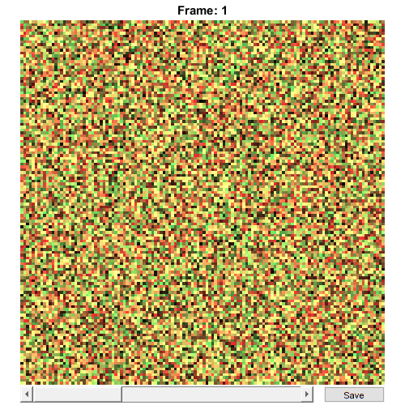
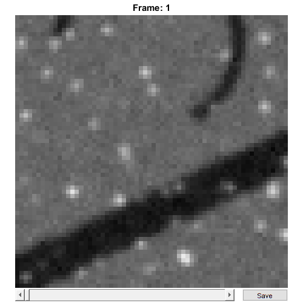

RawImgDummy
=======================================

Store 'dummy' raw image data


Usage
----------------------------------------------------------

```matlab
OBJ = RawImgDummy(FILENAME, CHS, CAL, ACQ)
OBJ = RawImgDummy(NAME, RAWDATA, CHS, CAL, ACQ)
```


Arguments
----------------------------------------------------------

   + `FILENAME` is the original filename (including the path) of this `RawImgDummy` object.
   + `CHS` is a scalar structure that contains information about the meaning of the image channels.
   + `CAL` is a scalar `CalibrationPixelSize` object.
   + `ACQ` is a scalar structure containing information about the image acquisition (e.g. line time, zoom factor etc).
   + `NAME` is the name of this `RawImgDummy` object.
   + `RAWDATA` is the raw image data for the `RawImgDummy` object.


Details
----------------------------------------------------------

`RawImgDummy` objects are used to contain all raw image data and metadata from 'dummy' raw image data, i.e. images that don't have a specific class designed to import their format.  This makes it possible to create functional RawImg objects from any data without requiring the overhead of creating a class (but also without the benefits of a streamlined creation/import process).  RawImgDummy objects are also created when RawImg objects are modified in certain ways (e.g. concatenated together or split up), since the modified objects no longer represent the original raw image file.


See Also
----------------------------------------------------------

   + [`RawImg` class documentation](matlab:doc('RawImg'))
   + [`Metadata` class documentation](matlab:doc('Metadata'))
   + [`Metadata` quick start guide](./id_md_Metadata.html)
   + [`CalibrationPixelSize` class documentation](matlab:doc('CalibrationPixelSize'))
   + [`CalibrationPixelSize` quick start guide](./id_md_Calibration.html)


Examples
----------------------------------------------------------

The following examples require the sample images and other files, which can be downloaded manually, from the University of Zurich website ([http://www.pharma.uzh.ch/en/research/functionalimaging/CHIPS.html](http://www.pharma.uzh.ch/en/research/functionalimaging/CHIPS.html)), or automatically, by running the function `utils.download_example_imgs()`.

<h3>Create a <tt>RawImgDummy</tt> object interactively</h3>

The following example will illustrate the process of creating a `RawImgDummy` object interactively, using already existing image data.

```matlab
% Call the RawImgDummy constructor with some randomly-generated data
rid001 = RawImgDummy('test', rand(128, 128, 2, 4))
```
Answer some questions about the image acquisition.  For example, specify that the image was not bidirectional, that the line time was 2ms, and that the zoom factor was 4.


```text
  Please enter a value for if the image is bidirectional [1/0]: 0
  Please enter a value for the line time [ms]: 2
  Please enter a value for the zoom factor: 4
```
Use the interactive dialogue box to select the dummy calibration (`calibration_dummy.mat`), which should be located in the subfolder tests>res, within the CHIPS root directory:


The next stage is to define the 'meaning' of the image channels.  For example, specify that the first channel represents a cytosolic calcium sensor expressed in astrocytes, and the second channel represents the blood plasma.  Press three and then enter, followed by one and then enter, to complete the selection.


```text
----- What is shown on channel 1? -----
```

```text
  >> 0) <blank>
     1) blood_plasma
     2) blood_rbcs
     3) Ca_Cyto_Astro
     4) Ca_Memb_Astro
     5) Ca_Neuron
     6) cellular_signal
     7) FRET_ratio
```

```text
Answer: 3
```

```text
----- What is shown on channel 2? -----
```

```text
  >> 0) <blank>
     1) blood_plasma
     2) blood_rbcs
     3) Ca_Cyto_Astro
     4) Ca_Memb_Astro
     5) Ca_Neuron
     6) cellular_signal
     7) FRET_ratio
```

```text
Answer: 1
```
We have now created a `RawImgDummy` object interactively.


```text
rid001 =
```

```text
  RawImgDummy with properties:
```

```text
            filename: 'test'
          isDenoised: 0
   isMotionCorrected: 0
   metadata_original: []
                name: 'test'
             rawdata: [4-D double]
                  t0: 0
            metadata: [1x1 Metadata]
```
<h3>Create a <tt>RawImgDummy</tt> object without any interaction</h3>

```matlab
% Specify the channels relevant for this raw image
channels002 = struct('Ca_Cyto_Astro', 1, 'blood_plasma', 2);

% Load the CalibrationPixelSize object
fnCalibration = fullfile(utils.CHIPS_rootdir, 'tests', 'res', ...
    'calibration_dummy.mat');
calibration = CalibrationPixelSize.load(fnCalibration);

% Specify some data about the image acquisition
nRows002 = 128;
nCols002 = 128;
acq002 = struct('isBiDi', false, 'lineTime', 2, 'zoom', 4, ...
    'nLinesPerFrameOrig', nRows002, 'nPixelsPerLineOrig', nCols002);

% Create the RawImgDummy object without any interaction
rid002 = RawImgDummy('test RID 002', rand(nRows002, nCols002, 2, 4), ...
    channels002, calibration, acq002);

% View the RawImgDummy object. (Note: your image may differ due to the
% random data used to generate it)
rid002.plot()
```


<h3>Create a <tt>RawImgDummy</tt> object from a .tif image</h3>

```matlab
% Specify the full path to the raw image object
fnRID003 = fullfile(utils.CHIPS_rootdir, 'tests', 'res', ...
    'ArtificialData_SNR_0.1_FOV_250.tif');

% Specify the channels relevant for this raw image
channels003 = struct('cellular_signal', 1);

% Specify some data about the image acquisition
nRows003 = 64;
nCols003 = 64;
acq003 = struct('isBiDi', false, 'lineTime', 0.5, 'zoom', 2, ...
    'nLinesPerFrameOrig', nRows003, 'nPixelsPerLineOrig', nCols003);

% Create the RawImgDummy object without any interaction
rid003 = RawImgDummy(fnRID003, channels003, calibration, acq003);

% View the RawImgDummy object
rid003.plot()
```

```text
Opening ArtificialData_SNR_0.1_FOV_250.tif: 100% [=================]

```


[Home](./index.html)

