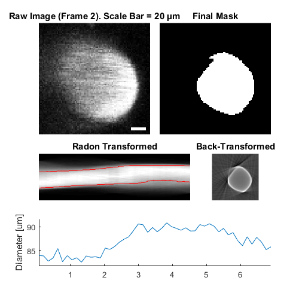

CompositeImg
=======================================

Contain and analyse groups of images from the same RawImg


Usage
----------------------------------------------------------


```text
OBJ = CompositeImg(RAWIMG, CONFIG, PROCTYPE)
OBJ = CompositeImg(NAME, ...)
```


Arguments
----------------------------------------------------------

   + `RAWIMG` is the `RawImg` object array that will be used to create the `ProcessedImg` child objects in the `CompositeImg` object.
   + `CONFIG` is the `Config` object that will be used to create the `ProcessedImg` child objects in the `CompositeImg` object.
   + `PROCTYPE` is the type of `ProcessedImg` child objects that will be created in the `CompositeImg` object.
   + `NAME` is the name for this `CompositeImg` object.


Details
----------------------------------------------------------

`CompositeImg` objects are used to contain and analyse groups of processable objects that are derived from the same `RawImg`.  This allows efficient use of memory, since the same `RawImg` object does not need to be duplicated to be analysed in different ways.


See Also
----------------------------------------------------------

   + [`CompositeImg` class documentation](matlab:doc('CompositeImg'))
   + [`ImgGroup` class documentation](matlab:doc('ImgGroup'))
   + [`ImgGroup` quick start guide](./ig_ImgGroup.html)
   + [`ProcessedImg` class documentation](matlab:doc('ProcessedImg'))
   + [`ProcessedImg` quick start guide](./pi_.html)
   + [`Config` class documentation](matlab:doc('Config'))
   + [`RawImgComposite` class documentation](matlab:doc('RawImgComposite'))


Examples
----------------------------------------------------------

The following examples require the sample images and other files, which can be downloaded manually, from the University of Zurich website ([http://www.pharma.uzh.ch/en/research/functionalimaging/CHIPS.html](http://www.pharma.uzh.ch/en/research/functionalimaging/CHIPS.html)), or automatically, by running the function `utils.download_example_imgs()`.

<h3>Create a <tt>CompositeImg</tt> object interactively from one or more files</h3>

The following example will illustrate the process of creating a `CompositeImg` object interactively.  Although it is possible to do so by using the constructor method followed by the `add()` method, it can be easier to use the static method `from_files`, as illustrated below.

```matlab
% Construct an CompositeImg using the static method from_files
ci01 = CompositeImg.from_files()
```
In order to load a raw image file, we must first select the type of `RawImg` to create.  Press three and then enter to select the SCIM_Tif.


```text
----- What type of RawImg would you like to load? -----
```

```text
  >> 1) BioFormats
     2) RawImgDummy
     3) SCIM_Tif
```

```text
Select a format: 3
```
Then, use the interactive dialogue box to select the raw image file `xsectscan_scim.tif`, which should be located in the subfolder tests>res, within the CHIPS root directory.


Use the interactive dialogue box to select the dummy calibration (`calibration_dummy.mat`):


The next stage is to define the 'meaning' of the image channels.  For this example we will specify the first channel as a cellular signal, and the second channel as blood plasma.  Press six and enter, followed by one and enter, to complete the selection.


```text
----- What is shown on channel 1? -----
```

```text
  >> 0) <blank>
     1) blood_plasma
     2) blood_rbcs
     3) Ca_Cyto_Astro
     4) Ca_Memb_Astro
     5) Ca_Neuron
     6) cellular_signal
     7) FRET_ratio
```

```text
Answer: 6
```

```text
----- What is shown on channel 2? -----
```

```text
  >> 0) <blank>
     1) blood_plasma
     2) blood_rbcs
     3) Ca_Cyto_Astro
     4) Ca_Memb_Astro
     5) Ca_Neuron
     6) cellular_signal
     7) FRET_ratio
```

```text
Answer: 1
```
Since no type of `ProcessedImg` has been specified, we must specify one or more types of `ProcessedImg` to create.  Press five followed by enter, then one followed by enter, then enter, to choose `XSectScan` and `CellScan`.


```text
----- Choose as many ProcessedImg classes as you would like -----
```

```text
  >> 0) <Finished>
     1) CellScan
     2) FrameScan
     3) LineScanDiam
     4) LineScanVel
     5) XSectScan
```

```text
Select a class: 5
```

```text
  >> 0) <Finished>
     1) CellScan
     2) FrameScan
     3) LineScanDiam
     4) LineScanVel
     5) XSectScan
```

```text
Select a class: 1
```

```text
  >> 0) <Finished>
     1) CellScan
     2) FrameScan
     3) LineScanDiam
     4) LineScanVel
     5) XSectScan
```

```text
Select a class:
```
Then, we must define the masks (i.e. the relevant part of the raw image) for the different `ProcessedImg` children.  Press four followed by enter, to choose a square mask for the `XSectScan`, then draw a square on the image that appears.  Afterwards, press enter to complete mask selection for the `XSectScan` images.


```text
===== Select the masks for the XSectScan images =====
```

```text
----- Which type of mask would you like to select? -----
```

```text
  >> 0) <finished>
     1) everything
     2) columns
     3) rows
     4) square
     5) rectangle
     6) polygon
     7) circle
     8) ellipse
     9) freehand
    10) even-lines
    11) odd-lines
    12) channels
```

```text
Select a maskType: 4
```


```text
----- Which type of mask would you like to select? -----
```

```text
  >> 0) <finished>
     1) everything
     2) columns
     3) rows
     4) square
     5) rectangle
     6) polygon
     7) circle
     8) ellipse
     9) freehand
    10) even-lines
    11) odd-lines
    12) channels
```

```text
Select a maskType:
```
We must also define masks for the different `CellScan`.  Press one followed by enter, then enter, to use all of the image.


```text
===== Select the masks for the CellScan images =====
```

```text
----- Which type of mask would you like to select? -----
```

```text
  >> 0) <finished>
     1) everything
     2) columns
     3) rows
     4) square
     5) rectangle
     6) polygon
     7) circle
     8) ellipse
     9) freehand
    10) even-lines
    11) odd-lines
    12) channels
```

```text
Select a maskType: 1
```

```text
----- Which type of mask would you like to select? -----
```

```text
  >> 0) <finished>
     1) everything
     2) columns
     3) rows
     4) square
     5) rectangle
     6) polygon
     7) circle
     8) ellipse
     9) freehand
    10) even-lines
    11) odd-lines
    12) channels
```

```text
Select a maskType:
```
Finally, we must select the appropriate `Calc` methods for the `CellScan`.  Press enter three times to choose the defaults.


```text
----- Which ROI detection method would you like to use? -----
```

```text
  >> 1) whole frame
     2) load ImageJ ROIs
     3) load mask from .tif or .mat file
     4) 2D FLIKA (automatic ROI selection)
     5) 2.5D FLIKA (automatic ROI selection)
     6) 3D FLIKA (automatic ROI selection)
     7) CellSort (automatic ROI selection)
```

```text
Select a detection method, please:
```

```text
----- Which ROI measuring method would you like to use? -----
```

```text
  >> 1) simple baseline normalised
```

```text
Select a measuring method, please:
```

```text
----- Which signal detection method would you like to use? -----
```

```text
  >> 1) no signal detection
     2) detect + classify signals
```

```text
Select a detection method, please:
```
We have now created a `CompositeImg` object interactively.


```text
ci01 =
```
```matlab
CompositeImg with properties:
```

```text
    imgTypes: {'CellScan'  'XSectScan'}
       masks: {{ "{{" }}1x1 cell}  {1x1 cell}}
    children: {[1x1 XSectScan]  [1x1 CellScan]}
   nChildren: 2
       state: 'unprocessed'
        name: 'xsectscan_scim'
      rawImg: [1x1 SCIM_Tif]
```
<h3>Prepare a <tt>RawImg</tt> object for use in these examples</h3>

```matlab
% Prepare a RawImg array for use in these examples
fnRawImg = fullfile(utils.CHIPS_rootdir, 'tests', 'res', ...
    'xsectscan_scim.tif');
channels = struct('cellular_signal', 1, 'blood_plasma', 2);
fnCalibration = fullfile(utils.CHIPS_rootdir, 'tests', 'res', ...
    'calibration_dummy.mat');
calibration = CalibrationPixelSize.load(fnCalibration);
rawImg = SCIM_Tif(fnRawImg, channels, calibration)
```

```text
Opening xsectscan_scim.tif: 100% [=================================]
rawImg = 
  SCIM_Tif with properties:

             filename: 'D:\Code\Matlab\2p-img-analysis\tests\res\xsectscan_scim.tif'
           isDenoised: 0
    isMotionCorrected: 0
    metadata_original: [1×1 struct]
                 name: 'xsectscan_scim'
              rawdata: [128×128×2×50 uint16]
                   t0: 0
             metadata: [1×1 Metadata]

```
<h3>Create a <tt>CompositeImg</tt> object without any interaction</h3>

```matlab
% Prepare a blank mask for convenience, and a square mask for this example
maskBlank = false(rawImg.metadata.nLinesPerFrame, ...
    rawImg.metadata.nPixelsPerLine);
maskSquare = maskBlank;
maskSquare(20:100, 20:100) = true;

% Create an ImgGroup object from ProcessedImg objects without any interaction
nameCI02 = 'test CI 02';
configTiRS = ConfigDiameterTiRS('thresholdFWHM', 0.65, ...
    'thresholdInv', 0.35);
procImgType = 'XSectScan';
ci02 = CompositeImg(nameCI02, rawImg, configTiRS, procImgType, maskSquare)
```

```text
ci02 = 
  CompositeImg with properties:

     imgTypes: {'XSectScan'}
        masks: {{ "{{" }}1×1 cell}}
     children: {[1×1 XSectScan]}
    nChildren: 1
        state: 'unprocessed'
         name: 'test CI 02'
       rawImg: [1×1 SCIM_Tif]

```
<h3>Add <tt>RawImg</tt> objects to an existing <tt>CompositeImg</tt> object with a custom config</h3>

```matlab
% Prepare a channel mask for this example
maskChannel = cat(3, true(size(maskBlank)), maskBlank);

% Add to an existing CompositeImg object with a custom config
procImgType = 'CellScan';
configCS = ConfigCellScan(...
    ConfigFindROIsFLIKA_2D('baselineFrames', 30, 'thresholdPuff', 4, ...
        'maxRiseTime', 30, 'minROIArea', 21), ...
    ConfigMeasureROIsDummy('baselineFrames', 30), ...
    ConfigDetectSigsDummy());
ci02.add(configCS, procImgType, maskChannel)
ci02
```

```text
ci02 = 
  CompositeImg with properties:

     imgTypes: {'CellScan'  'XSectScan'}
        masks: {{ "{{" }}1×1 cell}  {1×1 cell}}
     children: {[1×1 XSectScan]  [1×1 CellScan]}
    nChildren: 2
        state: 'unprocessed'
         name: 'test CI 02'
       rawImg: [1×1 SCIM_Tif]

```
<h3>Process an <tt>CompositeImg</tt> object (in parallel)</h3>

```matlab
% Process an CompositeImg object (in parallel).
% This code requires the Parallel Computing Toolbox to run in parallel
useParallel = true;
ci02 = ci02.process(useParallel)
```

```text
Processing children: 100% [========================================]
ci02 = 
  CompositeImg with properties:

     imgTypes: {'CellScan'  'XSectScan'}
        masks: {{ "{{" }}1×1 cell}  {1×1 cell}}
     children: {[1×1 XSectScan]  [1×1 CellScan]}
    nChildren: 2
        state: 'processed'
         name: 'test CI 02'
       rawImg: [1×1 SCIM_Tif]

```
<h3>Plot a figure showing the output from all children</h3>

```matlab
% Plot a figure showing the output from all children.
% Note: the figures are deliberately displayed smaller here
hFig = ci02.plot();
set(hFig, 'Units', 'Pixels', 'Position', [50, 50, 500, 500]);
```




<h3>Output the data from all children</h3>

```matlab
% Output the data.  This requires write access to the working directory
fnCSV02 = ci02.output_data('ci02', 'overwrite', true);
fID02 = fopen(fnCSV02{end}{1}, 'r');
fileContents02 = textscan(fID02, '%s');
fileContents02{1}{1:5}
fclose(fID02);
```

```text
Warning: The Data object has no output defined, so no data will be output. 
ans =
    'roiNames,area,centroidX,centroidY'
ans =
    'roi0001_0008_0012,32,13.50000,8.00000'
ans =
    'roi0002_0004_0021,32,22.00000,4.50000'
ans =
    'roi0003_0077_0034,168,38.07143,79.09524'
ans =
    'roi0004_0008_0037,32,38.50000,7.50000'

```
[Home](./index.html)

