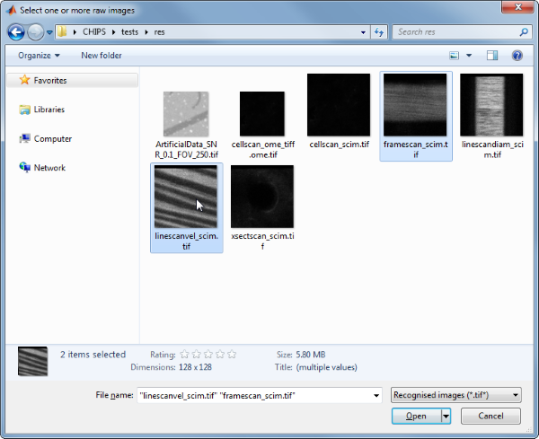
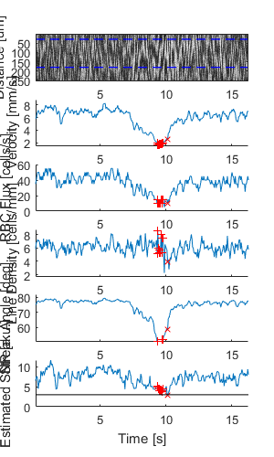
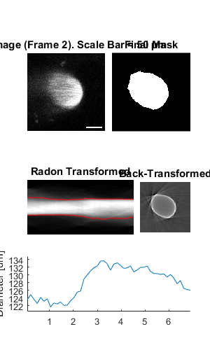

ImgGroup
=======================================

Contain and analyse groups of processable objects


Usage
----------------------------------------------------------


```text
OBJ = ImgGroup(RAWIMG, CONFIG, PROCTYPE)
OBJ = ImgGroup(..., PROCOBJ1, PROCOBJ2, ...)
OBJ = ImgGroup(NAME, ...)
```


Arguments
----------------------------------------------------------

   + `RAWIMG` is the `RawImg` object array that will be used to create the `ProcessedImg` child objects in the `ImgGroup` object.
   + `CONFIG` is the `Config` object that will be used to create the `ProcessedImg` child objects in the `ImgGroup` object.
   + `PROCTYPE` is the type of `ProcessedImg` child objects that will be created in the `ImgGroup` object.
   + `PROCOBJ1`, `PROCOBJ2`, ... are additional `ProcessedImg` objects that will be added to the `ImgGroup` object children.
   + `NAME` is the name for this `ImgGroup` object.


Details
----------------------------------------------------------

`ImgGroup` objects are used to contain and analyse groups of processable objects.  This can be `ProcessedImg` objects like `LineScanVel` or `CellScan` objects, as well as nested `ImgGroup` objects.


See Also
----------------------------------------------------------

   + [`ImgGroup` class documentation](matlab:doc('ImgGroup'))
   + [`ProcessedImg` class documentation](matlab:doc('ProcessedImg'))
   + [`ProcessedImg` quick start guide](./pi_.html)
   + [`Config` class documentation](matlab:doc('Config'))


Examples
----------------------------------------------------------

The following examples require the sample images and other files, which can be downloaded manually, from the University of Zurich website ([http://www.pharma.uzh.ch/en/research/functionalimaging/CHIPS.html](http://www.pharma.uzh.ch/en/research/functionalimaging/CHIPS.html)), or automatically, by running the function `utils.download_example_imgs()`.

<h3>Create an <tt>ImgGroup</tt> object interactively from one or more files</h3>

The following example will illustrate the process of creating a `ImgGroup` object interactively.  Although it is possible to do so by using the constructor method followed by the `add()` method, it can be easier to use the static method `from_files`, as illustrated below.

```matlab
% Construct an ImgGroup using the static method from_files
ig01 = ImgGroup.from_files()
```
Since no type of `ProcessedImg` has been specified, the first stage is to specify the type of `ProcessedImg` to create.  Press seven followed by enter to choose a `LineScanVel` in this case.


```text
----- What type of ProcessableImage would you like to create? -----
```

```text
  >> 1) ArbLineScan
     2) CellScan
     3) CompositeImg
     4) FrameScan
     5) ImgGroup
     6) LineScanDiam
     7) LineScanVel
     8) MultiChImg
     9) XSectScan
```

```text
Select a class: 7
```
Since we are going to choose `RawImg` files, we must also select the type of `RawImg` to create.  Press three and then enter to select the SCIM_Tif.


```text
----- What type of RawImg would you like to load? -----
```

```text
  >> 1) BioFormats
     2) RawImgDummy
     3) SCIM_Tif
```

```text
Select a format: 3
```
Then, use the interactive dialogue box to select the raw image files `framescan_scim.tif` and `linescanvel_scim.tif` (press shift or control/command to select multiple images), which should be located in the subfolder tests>res, within the CHIPS root directory. Although these two images are not really the same type, they will illustrate how to create an `ImgGroup` object.





Use the interactive dialogue box to select the dummy calibration (`calibration_dummy.mat`):


The next stage is to define the 'meaning' of the image channels.  For this example we will specify the first channel as blood plasma.  Press one and enter to complete the selection.


```text
----- What is shown on channel 1? -----
```

```text
  >> 0) <blank>
     1) blood_plasma
     2) blood_rbcs
     3) Ca_Cyto_Astro
     4) Ca_Memb_Astro
     5) Ca_Neuron
     6) cellular_signal
     7) FRET_ratio
```

```text
Answer: 1
```
The next stage is to specify which velocity calculation algorithm should be used. In this case we will choose the Radon transform method.  Press two and then enter to complete the selection.


```text
----- What type of velocity calculation would you like to use? -----
```

```text
  >> 1) CalcVelocityLSPIV
     2) CalcVelocityRadon
```

```text
Select a format: 2
```
The final stage is to select the left and right limits of the images to use for velocity calculations.  We will not show images here, but the procedure is the same as shown in the [`LineScanVel` examples](pi_LineScanVel.html).

We have now created a `ImgGroup` object interactively.


```text
ig01 =
```
```matlab
ImgGroup with properties:
```

```text
    children: {[1x1 LineScanVel]  [1x1 LineScanVel]}
   nChildren: 2
       state: 'unprocessed'
        name: []
```
The process is differerent from creating a `LineScanVel` object array because the `ImgGroup` constructor prompts us to choose the left and right limits for velocity calculation for every image, whereas the `LineScanVel` constructor assumes we want the same limits for every `RawImg`.

<h3>Prepare some <tt>RawImg</tt> objects for use in these examples</h3>

```matlab
% Prepare a RawImg array for use in these examples
fnRawImgArray = fullfile(utils.CHIPS_rootdir, 'tests', 'res', ...
    'linescanvel_scim.tif');
channelsArray = struct('blood_plasma', 1);
fnCalibration = fullfile(utils.CHIPS_rootdir, 'tests', 'res', ...
    'calibration_dummy.mat');
calibration = CalibrationPixelSize.load(fnCalibration);
rawImgArray(1:2) = SCIM_Tif(fnRawImgArray, channelsArray, calibration);
rawImgArray = copy(rawImgArray)
```

```text
Opening linescanvel_scim.tif: 100% [===============================]
rawImgArray =
  1×2 SCIM_Tif array with properties:

    filename
    isDenoised
    isMotionCorrected
    metadata_original
    name
    rawdata
    t0
    metadata


```
<h3>Prepare some <tt>ProcessedImg</tt> objects for use in these examples</h3>

```matlab
% Prepare a LineScanVel array for use in these examples
nameLSV = 'test LSV';
configRadon = ConfigVelocityRadon('windowTime', 200);
isDarkStreaks = [];
colsToUse = [15 90];
lsvArray = LineScanVel(nameLSV, rawImgArray, configRadon, ...
    isDarkStreaks, colsToUse)
```

```text
lsvArray =
  1×2 LineScanVel array with properties:

    plotList
    calcVelocity
    colsToUseVel
    isDarkStreaks
    state
    name
    rawImg


```
<h3>Create an <tt>ImgGroup</tt> object without any interaction</h3>

```matlab
% Create an ImgGroup object from ProcessedImg objects without any interaction
nameIG02 = 'test IG 02';
ig02 = ImgGroup(nameIG02, lsvArray)
```

```text
ig02 =
  ImgGroup with properties:

     children: {[1×2 LineScanVel]}
    nChildren: 1
        state: 'unprocessed'
         name: 'test IG 02'

```
<h3>Add <tt>RawImg</tt> objects to an existing <tt>ImgGroup</tt> object with a custom config</h3>

```matlab
% Prepare an extra RawImg for use in this example
fnRawImgXSect = fullfile(utils.CHIPS_rootdir, 'tests', 'res', ...
    'xsectscan_scim.tif');
channelsXSect = struct('blood_plasma', 2);
rawImgXSect = SCIM_Tif(fnRawImgXSect, channelsXSect, calibration);

% Add to an existing ImgGroup object with a custom config
procImgType = 'XSectScan';
configTiRS = ConfigDiameterTiRS('thresholdFWHM', 0.3, ...
    'thresholdInv', 0.25);
ig02.add(rawImgXSect, configTiRS, procImgType);
ig02
```

```text
Opening xsectscan_scim.tif: 100% [=================================]
ig02 =
  ImgGroup with properties:

     children: {[1×2 LineScanVel]  [1×1 XSectScan]}
    nChildren: 2
        state: 'unprocessed'
         name: 'test IG 02'

```
<h3>Process an <tt>ImgGroup</tt> object (in parallel)</h3>

```matlab
% Process an ImgGroup object (in parallel).
% This code requires the Parallel Computing Toolbox to run in parallel
useParallel = true;
ig02 = ig02.process(useParallel)
```

```text
Processing children: 100% [========================================]
ig02 =
  ImgGroup with properties:

     children: {[1×2 LineScanVel]  [1×1 XSectScan]}
    nChildren: 2
        state: 'processed'
         name: 'test IG 02'

```
<h3>Plot a figure showing the output from all children</h3>

```matlab
% Plot a figure showing the output from all children.
% Note: the figures are deliberately displayed smaller here
hFig = ig02.plot();
set(hFig, 'Position', [50, 50, 300, 500]);
```





<h3>Output the data from all children</h3>

```matlab
% Output the data.  This requires write access to the working directory
fnCSV02 = ig02.output_data('ig02', 'overwrite', true);
fID02 = fopen(fnCSV02{end}{1}, 'r');
fileContents02 = textscan(fID02, '%s');
fileContents02{1}{1:5}
fclose(fID02);
```

```text
ans =
    'time,diameter,areaPixels,maskSTD,mask'
ans =
    '0.06966,123.58714,2999,FALSE,FALSE'
ans =
    '0.20898,124.89888,3063,FALSE,FALSE'
ans =
    '0.34830,123.64894,3002,FALSE,FALSE'
ans =
    '0.48762,122.57335,2950,FALSE,FALSE'

```

---
[Home](./index.html)
