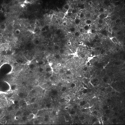
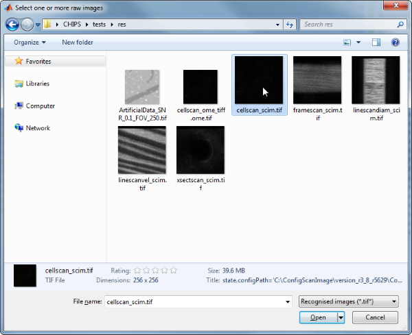
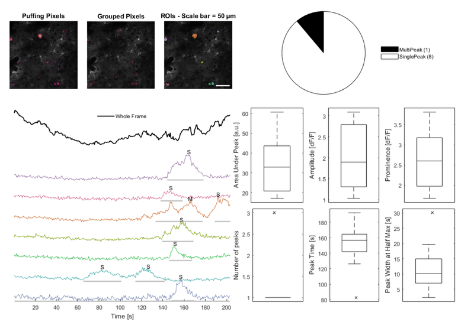
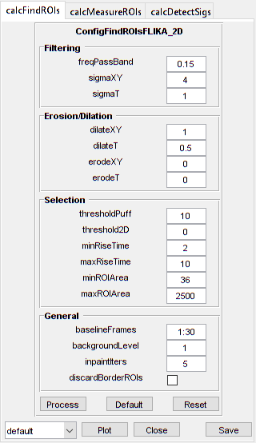

CellScan
=======================================

Analyse cellular signals


Usage
----------------------------------------------------------

```matlab
OBJ = CellScan(NAME, RAWIMG, CONFIG, CHANNEL)
```


Arguments
----------------------------------------------------------

   + `NAME` is the name for this `CellScan` object.
   + `RAWIMG` is the `RawImg` object that will be used to create the `CellScan` object.
   + `CONFIG` contains the configuration parameters needed for the `calcFindROIs`, `calcMeasureROIs` and `calcDetectSigs` objects.
   + `CHANNEL` is the channel number to use for analysis.


Details
----------------------------------------------------------

`CellScan` objects are used to analyse dynamic fluorescence signals of cellular origin (i.e. calcium dyes and genetic sensors, metabolite sensors, etc.)





See Also
----------------------------------------------------------

   + [`CellScan` class documentation](matlab:doc('CellScan'))
   + [`ConfigCellScan` class documentation](matlab:doc('ConfigCellScan'))
   + [`ConfigFindROIsDummy` class documentation](matlab:doc('ConfigFindROIsDummy'))
   + [`ConfigFindROIsFLIKA` class documentation](matlab:doc('ConfigFindROIsFLIKA'))
   + [`ConfigFindROIsFLIKA_2D` class documentation](matlab:doc('ConfigFindROIsFLIKA_2D'))
   + [`ConfigFindROIsFLIKA_2p5D` class documentation](matlab:doc('ConfigFindROIsFLIKA_2p5D'))
   + [`ConfigFindROIsFLIKA_3D` class documentation](matlab:doc('ConfigFindROIsFLIKA_3D'))
   + [`ConfigMeasureROIsDummy` class documentation](matlab:doc('ConfigMeasureROIsDummy'))
   + [`ConfigDetectSigsDummy` class documentation](matlab:doc('ConfigDetectSigsDummy'))
   + [`ConfigDetectSigsClsfy` class documentation](matlab:doc('ConfigDetectSigsClsfy'))
   + [`CalcFindROIsDummy` class documentation](matlab:doc('CalcFindROIsDummy'))
   + [`CalcFindROIsFLIKA` class documentation](matlab:doc('CalcFindROIsFLIKA'))
   + [`CalcFindROIsFLIKA_2D` class documentation](matlab:doc('CalcFindROIsFLIKA_2D'))
   + [`CalcFindROIsFLIKA_2p5D` class documentation](matlab:doc('CalcFindROIsFLIKA_2p5D'))
   + [`CalcFindROIsFLIKA_3D` class documentation](matlab:doc('CalcFindROIsFLIKA_3D'))
   + [`CalcMeasureROIsDummy` class documentation](matlab:doc('CalcMeasureROIsDummy'))
   + [`CalcDetectSigsDummy` class documentation](matlab:doc('CalcDetectSigsDummy'))
   + [`CalcDetectSigsClsfy` class documentation](matlab:doc('CalcDetectSigsClsfy'))
   + [`ImgGroup` class documentation](matlab:doc('ImgGroup'))
   + [`ImgGroup` quick start guide](./ig_ImgGroup.html)


Examples
----------------------------------------------------------

The following examples require the sample images and other files, which can be downloaded manually, from the University of Zurich website ([http://www.pharma.uzh.ch/en/research/functionalimaging/CHIPS.html](http://www.pharma.uzh.ch/en/research/functionalimaging/CHIPS.html)), or automatically, by running the function `utils.download_example_imgs()`.

<h3>Create a <tt>CellScan</tt> object interactively</h3>

The following example will illustrate the process of creating a `CellScan` object interactively, starting with calling the constructor.

```matlab
% Call the CellScan constructor
cs01 = CellScan()
```
Since no RawImg has been specified, the first stage is to select the type of RawImg to create.  Press three and then enter to select the SCIM_Tif.


```text
----- What type of RawImg would you like to load? -----
```

```text
  >> 1) BioFormats
     2) RawImgDummy
     3) SCIM_Tif
```

```text
Select a format: 3
```
Then, use the interactive dialogue box to select the raw image file `cellscan_scim.tif`, which should be located in the subfolder tests>res, within the CHIPS root directory.





Use the interactive dialogue box to select the dummy calibration (`calibration_dummy.mat`):


The next stage is to define the 'meaning' of the image channel(s).  The channel represents a cytosolic calcium sensor in astroytes. Press 1 and then enter to complete the selection.


```text
----- What is shown on channel 1? -----
```

```text
  >> 0) <blank>
     1) Ca_Cyto_Astro
     2) Ca_Memb_Astro
     3) Ca_Neuron
     4) cellular_signal
     5) FRET_ratio
```

```text
Answer: 1
```
Since `CellScan` objects require a method for ROI identification, a method for ROI measurement, and a method for signal detection, we have to specify our choice.

CellScan defaults to a whole frame analysis (i.e. one ROI covers the whole frame). We'd like to use 3D FLIKA instead, because we want to identify ROIs based on activity. Press 6 and then enter to complete the selection.


```text
----- Which ROI detection method would you like to use? -----
```

```text
  >> 1) whole frame
     2) load ImageJ ROIs
     3) load mask from .tif or .mat file
     4) 2D FLIKA (automatic ROI selection)
     5) 2.5D FLIKA (automatic ROI selection)
     6) 3D FLIKA (automatic ROI selection)
     7) CellSort (automatic ROI selection)
```

```text
Select a detection method, please: 6
```
The next stage is to specify the ROI measuring method. CellScan uses simple baseline calculation as the default. Press enter to complete the selection.


```text
----- Which ROI measuring method would you like to use? -----
```

```text
  >> 1) simple baseline normalised
```

```text
Select a measuring method, please:
```
The last stage is to specify the signal detection method. We want to classify signals based on shape and to do some basic measurements like amplitude, etc. Press 2 and then enter to complete the selection.

----- Which signal detection method would you like to use? -----


```text
  >> 1) no signal detection
     2) detect + classify signals
```
Select a detection method, please: 2

We have now created a CellScan object interactively.


```text
cs01 =
```

```text
  CellScan with properties:
```

```text
      calcFindROIs: [1x1 CalcFindROIsFLIKA_3D]
   calcMeasureROIs: [1x1 CalcMeasureROIsDummy]
    calcDetectSigs: [1x1 CalcDetectSigsClsfy]
      channelToUse: 1
          plotList: [1x1 struct]
             state: 'unprocessed'
              name: 'cellscan_scim'
            rawImg: [1x1 SCIM_Tif]
```
The process is almost exactly the same to create an array of `CellScan` objects; when the software prompts you to select one or more raw images, simply select multiple images by using either the shift or control key.

<h3>Prepare a <tt>RawImg</tt> for use in these examples</h3>

```matlab
% Prepare a rawImg for use in these examples
fnRawImg = fullfile(utils.CHIPS_rootdir, 'tests', 'res', ...
    'cellscan_scim.tif');
channels = struct('Ca_Cyto_Astro', 1);
fnCalibration = fullfile(utils.CHIPS_rootdir, 'tests', 'res', ...
    'calibration_dummy.mat');
calibration = CalibrationPixelSize.load(fnCalibration);
rawImg = SCIM_Tif(fnRawImg, channels, calibration);
```

```text
Opening cellscan_scim.tif: 100% [==================================]

```
<h3>Create a <tt>CellScan</tt> object without any interaction</h3>

```matlab
% Create a CellScan object without any interaction
nameCS02 = 'test CS 02';
configFind = ConfigFindROIsFLIKA_3D();
configMeasure = ConfigMeasureROIsDummy();
configDetect = ConfigDetectSigsDummy();
configCS = ConfigCellScan(configFind, configMeasure, configDetect);
channelToUse = 1;
cs02 = CellScan(nameCS02, rawImg, configCS, channelToUse)
```

```text
cs02 =
  CellScan with properties:

       calcFindROIs: [1×1 CalcFindROIsFLIKA_3D]
    calcMeasureROIs: [1×1 CalcMeasureROIsDummy]
     calcDetectSigs: [1×1 CalcDetectSigsDummy]
       channelToUse: 1
           plotList: [1×1 struct]
              state: 'unprocessed'
               name: 'test CS 02'
             rawImg: [1×1 SCIM_Tif]

```
<h3>Create a <tt>CellScan</tt> object array</h3>

```matlab
% Create a CellScan object array
rawImgArray(1:3) = copy(rawImg);
rawImgArray = copy(rawImgArray);
csArray = CellScan('test CS Array', rawImgArray, configCS, channelToUse)
```

```text
csArray =
  1×3 CellScan array with properties:

    calcFindROIs
    calcMeasureROIs
    calcDetectSigs
    channelToUse
    plotList
    state
    name
    rawImg


```
<h3>Create a <tt>CellScan</tt> object with a custom config</h3>

```matlab
% Create a CellScan object with a custom config
configFindCustom = ConfigFindROIsFLIKA_2D('baselineFrames', 30, ...
    'freqPassBand', 0.15, 'sigmaXY', 4, 'dilateXY', 1, ...
    'thresholdPuff', 10, 'minRiseTime', 2, 'maxRiseTime', 10, ...
    'minROIArea', 36);
configMeasureCustom = ConfigMeasureROIsDummy('baselineFrames', 30);
configDetectCustom = ConfigDetectSigsClsfy('baselineFrames', 30, ...
    'thresholdSP', 9, 'lpWindowTime', 6, 'spPassBandMin', 0.015, ...
    'spPassBandMax', 0.6, 'spFilterOrder', 10);
configCSCustom = ConfigCellScan(configFindCustom, configMeasureCustom, ...
    configDetectCustom);
cs03 = CellScan('test CS 03', rawImg, configCSCustom, channelToUse);
confFind = cs03.calcFindROIs.config
confMeasure = cs03.calcMeasureROIs.config
confDetect = cs03.calcDetectSigs.config
```

```text
confFind =
  ConfigFindROIsFLIKA_2D with properties:

          threshold2D: 0
       baselineFrames: [30×1 double]
              sigmaXY: 4
               sigmaT: 1
         freqPassBand: 0.1500
        thresholdPuff: 10
          minRiseTime: 2
          maxRiseTime: 10
             dilateXY: 1
              dilateT: 0.5000
              erodeXY: 0
               erodeT: 0
      backgroundLevel: 1
         inpaintIters: 5
    discardBorderROIs: 0
           maxROIArea: 2500
           minROIArea: 36
confMeasure =
  ConfigMeasureROIsDummy with properties:

     baselineFrames: [30×1 double]
    backgroundLevel: 1
      propagateNaNs: 0
confDetect =
  ConfigDetectSigsClsfy with properties:

    backgroundLevel: 1
     baselineFrames: [30×1 double]
        excludeNaNs: 1
       lpWindowTime: 6
      propagateNaNs: 1
      spFilterOrder: 10
      spPassBandMax: 0.6000
      spPassBandMin: 0.0150
        thresholdLP: 7
        thresholdSP: 9

```
<h3>Process a scalar <tt>CellScan</tt> object</h3>

```matlab
% Process a scalar CellScan object
cs03 = cs03.process()
```

```text
Finding ROIs: 100% [===============================================]
Measuring ROIs: 100% [=============================================]
Detecting signals: 100% [==========================================]
cs03 =
  CellScan with properties:

       calcFindROIs: [1×1 CalcFindROIsFLIKA_2D]
    calcMeasureROIs: [1×1 CalcMeasureROIsDummy]
     calcDetectSigs: [1×1 CalcDetectSigsClsfy]
       channelToUse: 1
           plotList: [1×1 struct]
              state: 'processed'
               name: 'test CS 03'
             rawImg: [1×1 SCIM_Tif]

```
<h3>Process a <tt>CellScan</tt> object array (in parallel)</h3>

```matlab
% Process a CellScan object array (in parallel)
% This code requires the Parallel Computing Toolbox to run in parallel
useParallel = true;
csArray = csArray.process(useParallel);
csArray_state = {csArray.state}
```

```text
Processing array: 100% [===========================================]
csArray_state =
  1×3 cell array
    'processed'    'processed'    'processed'

```
<h3>Plot a figure showing an overview of identified ROIs</h3>

```matlab
% Plot a figure showing an overview of identified ROIs
hFig03 = cs03.plot();
set(hFig03, 'Units', 'pixels', 'Position', [50, 50, 1100, 750]);
```


<h3>Produce a GUI to optimise the parameters</h3>

```matlab
% Produce a GUI to optimise the parameters
hFigOpt = cs03.opt_config();
```


<h3>Output the data</h3>

```matlab
% Output the data.  This requires write access to the working directory.
fnCS03 = cs03.output_data('cs03', 'overwrite', true);
```
```matlab
% First, the findROIs data
fID03_find = fopen(fnCS03{1}, 'r');
fileContents03f = textscan(fID03_find, '%s');
fileContents03f{1}{1:5}
fclose(fID03_find);
```

```text
ans =
    'roiNames,area,centroidX,centroidY'
ans =
    'roi0001_0067_0001,112,5.670,69.054'
ans =
    'roi0002_0236_0008,63,13.397,239.286'
ans =
    'roi0003_0053_0107,247,115.061,56.117'
ans =
    'roi0004_0158_0138,50,143.040,156.000'

```
```matlab
% Then, the measureROIs data
fID03_measure = fopen(fnCS03{2}, 'r');
fileContents03m = textscan(fID03_measure, '%s');
fileContents03m{1}{1:5}
fclose(fID03_measure);
```

```text
ans =
    'time,rawTrace,rawTraceNorm,traces_roi0001_0067_0001,traces_roi0002_0236_0008,traces_roi0003_0053_0107,traces_roi0004_0158_0138,traces_roi0005_0236_0168,traces_roi0006_0236_0178,traces_roi0007_0039_0200,tracesNorm_roi0001_0067_0001,tracesNorm_roi0002_0236_0008,tracesNorm_roi0003_0053_0107,tracesNorm_roi0004_0158_0138,tracesNorm_roi0005_0236_0168,tracesNorm_roi0006_0236_0178,tracesNorm_roi0007_0039_0200'
ans =
    '0.339,848.056,0.224,1130.902,1075.889,685.591,1099.540,710.526,934.609,759.978,0.424,0.128,0.071,-0.144,0.312,0.402,0.074'
ans =
    '1.018,863.771,0.345,1126.330,1005.794,727.348,1278.040,656.807,914.379,788.378,0.399,-0.143,0.440,0.514,-0.006,0.307,0.253'
ans =
    '1.696,856.849,0.291,1139.607,1110.540,697.955,1180.100,674.404,841.460,694.978,0.472,0.263,0.180,0.153,0.098,-0.035,-0.334'
ans =
    '2.375,857.652,0.298,1026.821,1076.587,714.008,1161.120,766.965,856.080,765.000,-0.144,0.131,0.322,0.083,0.645,0.034,0.106'

```
```matlab
% Finally, the detectSigs data
fID03_detect = fopen(fnCS03{3}, 'r');
fileContents03d = textscan(fID03_detect, '%s');
fileContents03d{1}{1:5}
fclose(fID03_detect);
```

```text
ans =
    'peakAUC,prominence,amplitude,peakTime,peakStart,peakStartHalf,halfWidth,fullWidth,numPeaks,peakType,roiName'
ans =
    '60.725,3.813,2.294,164.192,144.516,156.729,10.103,33.246,1,SinglePeak,roi0001_0067_0001'
ans =
    '19.096,1.670,1.034,147.230,138.410,140.445,10.921,19.676,1,SinglePeak,roi0002_0236_0008'
ans =
    '17.097,2.970,2.968,192.010,189.296,190.653,2.251,13.570,1,SinglePeak,roi0003_0053_0107'
ans =
    '55.831,2.529,3.090,165.549,133.661,142.481,30.066,43.423,3,MultiPeak,roi0003_0053_0107'

```

---
[Home](./index.html)
