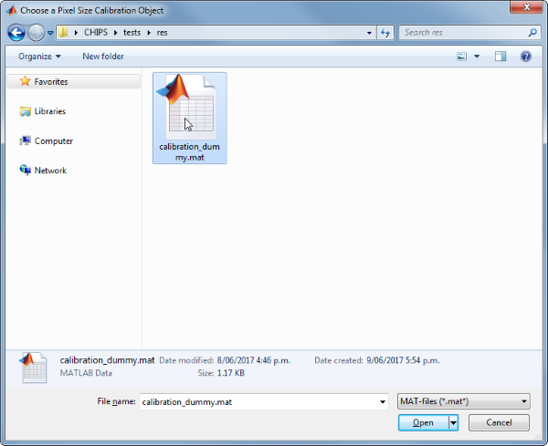

FrameScan
=======================================

Analyse frame scan images of vessels


Usage
----------------------------------------------------------

```matlab
OBJ = FrameScan(NAME, RAWIMG, CONFIG, ISDS, COLS_V, ROWS_V, COLS_D)
```


Arguments
----------------------------------------------------------

   + `NAME` is the name for this `FrameScan` object.
   + `RAWIMG` is the `RawImg` object that will be used to create the `FrameScan` object.
   + `CONFIG` contains the configuration parameters needed for the `calcVelocity` and `calcDiameter` object.
   + `ISDS` specifies whether the streaks to analyse are dark (i.e. negatively labelled) or bright (i.e. positively labelled).
   + `COLS_V` specifies the left and right columns that will form the edges of the `RawImg` data to use in the velocity calculation.
   + `ROWS_V` specifies the top and bottom rows that will form the edges of the `RawImg` data to use in the velocity calculation.
   + `COLS_D` specifies the left and right columns that will form the edges of the `RawImg` data to use in the diameter calculation.


Details
----------------------------------------------------------

`FrameScan` objects are used to analyse both the velocities and diameters from frame scan images of blood vessels.  Typically, the blood plasma will be labelled by a fluorescent marker, like a dextran conjugated fluorophore (e.g. FITC, as in the figure below), but the method also works with labelled red blood cells (RBCs).


See Also
----------------------------------------------------------

   + [`FrameScan` class documentation](matlab:doc('FrameScan'))
   + [`ConfigFrameScan` class documentation](matlab:doc('ConfigFrameScan'))
   + [`ConfigVelocityRadon` class documentation](matlab:doc('ConfigVelocityRadon'))
   + [`ConfigVelocityLSPIV` class documentation](matlab:doc('ConfigVelocityLSPIV'))
   + [`ConfigDiameterFWHM` class documentation](matlab:doc('ConfigDiameterFWHM'))
   + [`CalcVelocityRadon` class documentation](matlab:doc('CalcVelocityRadon'))
   + [`CalcVelocityLSPIV` class documentation](matlab:doc('CalcVelocityLSPIV'))
   + [`CalcDiameterFWHM` class documentation](matlab:doc('CalcDiameterFWHM'))
   + [`ImgGroup` class documentation](matlab:doc('ImgGroup'))
   + [`ImgGroup` quick start guide](./ig_ImgGroup.html)


Examples
----------------------------------------------------------

The following examples require the sample images and other files, which can be downloaded manually, from the University of Zurich website ([http://www.pharma.uzh.ch/en/research/functionalimaging/CHIPS.html](http://www.pharma.uzh.ch/en/research/functionalimaging/CHIPS.html)), or automatically, by running the function `utils.download_example_imgs()`.

<h3>Create a <tt>FrameScan</tt> object interactively</h3>

The following example will illustrate the process of creating a `FrameScan` object interactively, starting with calling the constructor.

```matlab
% Call the FrameScan constructor
fs01 = FrameScan()
```
Since no RawImg has been specified, the first stage is to select the type of RawImg to create.  Press three and then enter to select the SCIM_Tif.


```text
----- What type of RawImg would you like to load? -----
```

```text
  >> 1) BioFormats
     2) RawImgDummy
     3) SCIM_Tif
```

```text
Select a format: 3
```
A warning may appear about the pixel aspect ratio, but this is not relevant for `FrameScan` images.

Then, use the interactive dialogue box to select the raw image file `framescan_scim.tif`, which should be located in the subfolder tests>res, within the CHIPS root directory.


Use the interactive dialogue box to select the dummy calibration (`calibration_dummy.mat`):





The next stage is to define the 'meaning' of the image channels.  The first channel represents the blood plasma. Press one and then enter to complete the selection.


```text
----- What is shown on channel 1? -----
```

```text
  >> 0) <blank>
     1) blood_plasma
     2) blood_rbcs
```

```text
Answer: 1
```
The next stage is to specify which velocity calculation algorithm should be used. In this case we will choose the Radon transform method.  Press two and then enter to complete the selection.


```text
----- What type of velocity calculation would you like to use? -----
```

```text
  >> 1) CalcVelocityLSPIV
     2) CalcVelocityRadon
```

```text
Select a format: 2
```
The next stage is to select the limits of the image to use for velocity calculations.  Selecting left and right limits can be useful to exclude the edges where there can be artefacts associated with the scan mirrors changing speed and/or direction.  Selecting top and bottom limits ensures that the velocity is only calculated inside the vessel.


The final stage is to select the left and right limits of the image to use for diameter calculations.  This can be useful to exclude the edges where there can be artefacts associated with other vessels or fluorescent areas.


We have now created a `FrameScan` object interactively.


```text
fs01 =
```

```text
  FrameScan with properties:
```

```text
    calcDiameter: [1x1 CalcDiameterFWHM]
   colsToUseDiam: [21 110]
    rowsToUseVel: [27 94]
        plotList: [1x1 struct]
    calcVelocity: [1x1 CalcVelocityRadon]
    colsToUseVel: [20 112]
   isDarkStreaks: 1
           state: 'unprocessed'
            name: 'framescan_scim'
          rawImg: [1x1 SCIM_Tif]
    isDarkPlasma: 0
```
The process is almost exactly the same to create an array of `FrameScan` objects; when the software prompts you to select one or more raw images, simply select multiple images by using either the shift or control key.

<h3>Prepare a <tt>RawImg</tt> for use in these examples</h3>

```matlab
% Prepare a rawImg for use in these examples
fnRawImg = fullfile(utils.CHIPS_rootdir, 'tests', 'res', ...
    'framescan_scim.tif');
channels = struct('blood_plasma', 1);
fnCalibration = fullfile(utils.CHIPS_rootdir, 'tests', 'res', ...
    'calibration_dummy.mat');
calibration = CalibrationPixelSize.load(fnCalibration);
rawImg = SCIM_Tif(fnRawImg, channels, calibration);
```

```text
Opening framescan_scim.tif: 100% [=================================]

```
<h3>Create a <tt>FrameScan</tt> object without any interaction</h3>

```matlab
% Create a FrameScan object without any interaction
nameFS02 = 'test FS 02';
configFS = ConfigFrameScan(ConfigVelocityLSPIV(), ConfigDiameterFWHM);
isDarkStreaks = [];
colsToUseVel = [20 112];
rowsToUseVel = [27 94];
colsToUseDiam = [21 110];
fs02 = FrameScan(nameFS02, rawImg, configFS, isDarkStreaks, ...
    colsToUseVel, rowsToUseVel, colsToUseDiam)
```

```text
fs02 =
  FrameScan with properties:

     calcDiameter: [1×1 CalcDiameterFWHM]
    colsToUseDiam: [21 110]
     rowsToUseVel: [27 94]
         plotList: [1×1 struct]
     calcVelocity: [1×1 CalcVelocityLSPIV]
     colsToUseVel: [20 112]
    isDarkStreaks: 1
            state: 'unprocessed'
             name: 'test FS 02'
           rawImg: [1×1 SCIM_Tif]
     isDarkPlasma: 0

```
<h3>Create a <tt>FrameScan</tt> object with a custom config</h3>

```matlab
% Create a FrameScan object with a custom config
configCustom = ConfigFrameScan(...
    ConfigVelocityRadon('windowTime', 30, 'nOverlap', 6), ...
    ConfigDiameterFWHM('maxRate', 10, 'lev50', 0.6));
fs03 = FrameScan('test FS 03', rawImg, configCustom, ...
    isDarkStreaks, colsToUseVel, rowsToUseVel, colsToUseDiam);
confDiam = fs03.calcDiameter.config
confVel = fs03.calcVelocity.config
```

```text
confDiam =
  ConfigDiameterFWHM with properties:

           lev50: 0.6000
         maxRate: 10
    thresholdSTD: 3
confVel =
  ConfigVelocityRadon with properties:

       windowTime: 30
         nOverlap: 6
         thetaMax: 90
         thetaMin: -90
       incrCoarse: 1
         incrFine: 0.1000
      rangeCoarse: 10
        rangeFine: 3
        tolCoarse: 8
       maxNCoarse: 2
         maxNFull: 1
      minPeakDist: 5
    thresholdProm: 0.3000
        pointsSNR: 12
     thresholdSNR: 3
     thresholdSTD: 3

```
<h3>Create a <tt>FrameScan</tt> object array</h3>

```matlab
% Create the RawImg array first
rawImgArray(1:3) = copy(rawImg);
rawImgArray = copy(rawImgArray)
```

```text
rawImgArray =
  1×3 SCIM_Tif array with properties:

    filename
    isDenoised
    isMotionCorrected
    metadata_original
    name
    rawdata
    t0
    metadata


```
```matlab
% Then create the FrameScan object array
fsArray = FrameScan('test FS Array', rawImgArray, configCustom, ...
    isDarkStreaks, colsToUseVel, rowsToUseVel, colsToUseDiam)
```

```text
fsArray =
  1×3 FrameScan array with properties:

    calcDiameter
    colsToUseDiam
    rowsToUseVel
    plotList
    calcVelocity
    colsToUseVel
    isDarkStreaks
    state
    name
    rawImg
    isDarkPlasma


```
<h3>Process a scalar <tt>FrameScan</tt> object</h3>

```matlab
% Process a scalar FrameScan object
fs03 = fs03.process()
```

```text
Calculating velocity: 100% [=======================================]
Calculating diameter: 100% [=======================================]
fs03 =
  FrameScan with properties:

     calcDiameter: [1×1 CalcDiameterFWHM]
    colsToUseDiam: [21 110]
     rowsToUseVel: [27 94]
         plotList: [1×1 struct]
     calcVelocity: [1×1 CalcVelocityRadon]
     colsToUseVel: [20 112]
    isDarkStreaks: 1
            state: 'processed'
             name: 'test FS 03'
           rawImg: [1×1 SCIM_Tif]
     isDarkPlasma: 0

```
<h3>Process a <tt>FrameScan</tt> object array (in parallel)</h3>

```matlab
% Process a FrameScan object array (in parallel).
% This code requires the Parallel Computing Toolbox to run in parallel
useParallel = true;
fsArray = fsArray.process(useParallel);
fsArray_state = {fsArray.state}
```

```text
Processing array: 100% [===========================================]
fsArray_state =
  1×3 cell array
    'processed'    'processed'    'processed'

```
<h3>Plot a figure showing the output</h3>

```matlab
% Plot a figure showing the output
hFig03 = fs03.plot();
set(hFig03, 'Position', [50, 50, 800, 1000])
```


<h3>Produce a GUI to optimise the parameters</h3>

```matlab
% Produce a GUI to optimise the parameters
hFigOpt = fs03.opt_config();
```


<h3>Output the data</h3>

```matlab
% Output the data.  This requires write access to the working directory
fnCSV03 = fs03.output_data('fs03', 'overwrite', true);
```
```matlab
% First, the diameter data
fID03_diameter = fopen(fnCSV03{1}, 'r');
fileContents03d = textscan(fID03_diameter, '%s');
fileContents03d{1}{1:5}
fclose(fID03_diameter);
```

```text
ans =
    'time,diameter,maskSTD,mask'
ans =
    '0.083,138.032,FALSE,FALSE'
ans =
    '0.248,136.281,FALSE,FALSE'
ans =
    '0.413,135.157,FALSE,FALSE'
ans =
    '0.578,136.262,FALSE,FALSE'

```
```matlab
% Then, the velocity data
fID03_velocity = fopen(fnCSV03{2}, 'r');
fileContents03v = textscan(fID03_velocity, '%s');
fileContents03v{1}{1:5}
fclose(fID03_velocity);
```

```text
ans =
    'time,velocity,flux,lineDensity,linearDensity,yPosition,theta,estSNR,maskSNR,maskSTD,mask'
ans =
    '0.016,596.826,66.489,0.111,0.007,103,89.700,4.785,FALSE,TRUE,TRUE'
ans =
    '0.020,34.338,199.468,5.809,0.368,116,84.800,4.848,FALSE,FALSE,FALSE'
ans =
    '0.024,34.338,199.468,5.809,0.326,130,84.800,7.208,FALSE,FALSE,FALSE'
ans =
    '0.028,36.452,166.223,4.560,0.324,143,85.100,9.288,FALSE,FALSE,FALSE'

```

---
[Home](./index.html)
