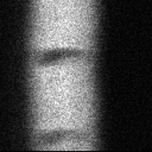
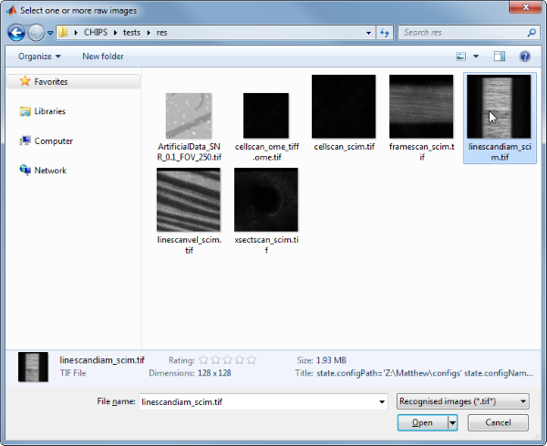
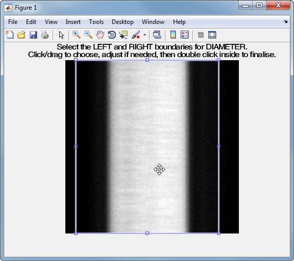
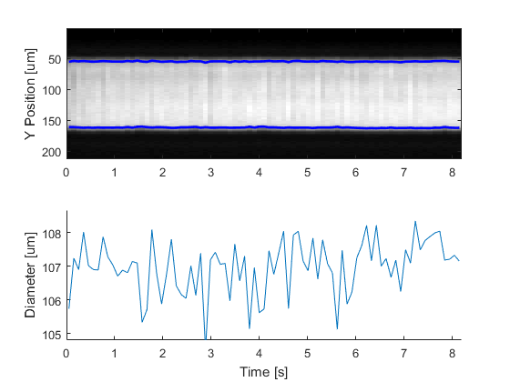
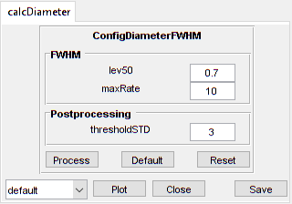

LineScanDiam
=======================================

Analyse line scan images of vessel diameters


Usage
----------------------------------------------------------

```matlab
OBJ = LineScanDiam(NAME, RAWIMG, CONFIG, COLS, CH, ISDP)
```


Arguments
----------------------------------------------------------

   + `NAME` is the name for this `LineScanDiam` object.
   + `RAWIMG` is the `RawImg` object that will be used to create the `LineScanDiam` object.
   + `CONFIG` contains the configuration parameters needed for the `calcDiameter` object.
   + `COLS` specifies the left and right columns that will form the edges of the `RawImg` data to use in the calculation.
   + `CH` specifies the channel to be used for calculating the diameter.
   + `ISDP` specifies whether the vessel lumen to analyse is bright (i.e. positively labelled) or dark (i.e. negatively labelled).


Details
----------------------------------------------------------

`LineScanDiam` objects are used to analyse the diameters from line scan images acquired by scanning perpendicular to the vessel axis.  Typically, the blood plasma will be labelled by a fluorescent marker, like a dextran conjugated fluorophore (e.g. FITC, as in the figure below).





See Also
----------------------------------------------------------

   + [`LineScanDiam` class documentation](matlab:doc('LineScanDiam'))
   + [`ConfigDiameterFWHM` class documentation](matlab:doc('ConfigDiameterFWHM'))
   + [`CalcDiameterFWHM` class documentation](matlab:doc('CalcDiameterFWHM'))
   + [`ImgGroup` class documentation](matlab:doc('ImgGroup'))
   + [`ImgGroup` quick start guide](./ig_ImgGroup.html)


Examples
----------------------------------------------------------

The following examples require the sample images and other files, which can be downloaded manually, from the University of Zurich website ([http://www.pharma.uzh.ch/en/research/functionalimaging/CHIPS.html](http://www.pharma.uzh.ch/en/research/functionalimaging/CHIPS.html)), or automatically, by running the function `utils.download_example_imgs()`.

<h3>Create a <tt>LineScanDiam</tt> object interactively</h3>

The following example will illustrate the process of creating a `LineScanDiam` object interactively, starting with calling the constructor.

```matlab
% Call the LineScanDiam constructor
lsd01 = LineScanDiam()
```
Since no RawImg has been specified, the first stage is to select the type of RawImg to create.  Press three and then enter to select the SCIM_Tif.


```text
----- What type of RawImg would you like to load? -----
```

```text
  >> 1) BioFormats
     2) RawImgDummy
     3) SCIM_Tif
```

```text
Select a format: 3
```
Then, use the interactive dialogue box to select the raw image file `linescandiam_scim.tif`, which should be located in the subfolder tests>res, within the CHIPS root directory.





Use the interactive dialogue box to select the dummy calibration (`calibration_dummy.mat`):


The next stage is to define the 'meaning' of the image channels.  The first channel represents the blood plasma.  Press one and then enter to complete the selection.


```text
----- What is shown on channel 2? -----
```

```text
  >> 0) <blank>
     1) blood_plasma
     2) blood_rbcs
```

```text
Answer: 1
```
The final stage is to select the left and right limits of the image to use for diameter calculations.  This can be useful to exclude the edges where there can be artefacts associated with other vessels or fluorescent areas.





We have now created a `LineScanDiam` object interactively.


```text
lsd01 =
```

```text
  LineScanDiam with properties:
```

```text
    calcDiameter: [1x1 CalcDiameterFWHM]
    channelToUse: 2
   colsToUseDiam: [8 114]
        plotList: [1x1 struct]
           state: 'unprocessed'
            name: 'diamlinescan_scim'
          rawImg: [1x1 SCIM_Tif]
    isDarkPlasma: 0
```
The process is almost exactly the same to create an array of `LineScanDiam` objects; when the software prompts you to select one or more raw images, simply select multiple images by using either the shift or control key.

<h3>Prepare a <tt>RawImg</tt> for use in these examples</h3>

```matlab
% Prepare a rawImg for use in these examples
fnRawImg = fullfile(utils.CHIPS_rootdir, 'tests', 'res', ...
    'linescandiam_scim.tif');
channels = struct('blood_plasma', 1);
fnCalibration = fullfile(utils.CHIPS_rootdir, 'tests', 'res', ...
    'calibration_dummy.mat');
calibration = CalibrationPixelSize.load(fnCalibration);
rawImg = SCIM_Tif(fnRawImg, channels, calibration);
```

```text
Opening linescandiam_scim.tif: 100% [==============================]

```
<h3>Create a <tt>LineScanDiam</tt> object without any interaction</h3>

```matlab
% Create a LineScanDiam object without any interaction
nameLSD02 = 'test LSD 02';
configFWHM = ConfigDiameterFWHM();
colsToUse = [8 114];
lsd02 = LineScanDiam(nameLSD02, rawImg, configFWHM, colsToUse)
```

```text
lsd02 = 
  LineScanDiam with properties:

     calcDiameter: [1×1 CalcDiameterFWHM]
     channelToUse: 1
    colsToUseDiam: [8 114]
         plotList: [1×1 struct]
            state: 'unprocessed'
             name: 'test LSD 02'
           rawImg: [1×1 SCIM_Tif]
     isDarkPlasma: 0

```
<h3>Create a <tt>LineScanDiam</tt> object with a custom config</h3>

```matlab
% Create a LineScanDiam object with a custom config
configCustom = ConfigDiameterFWHM('maxRate', 10, 'lev50', 0.7);
lsd03 = LineScanDiam('test LSD 03', rawImg, configCustom, colsToUse);
confDiam = lsd03.calcDiameter.config
```

```text
confDiam = 
  ConfigDiameterFWHM with properties:

           lev50: 0.7000
         maxRate: 10
    thresholdSTD: 3

```
<h3>Create a <tt>LineScanDiam</tt> object array</h3>

```matlab
% Create the RawImg array first
rawImgArray(1:3) = copy(rawImg);
rawImgArray = copy(rawImgArray)
```

```text
rawImgArray = 
  1×3 SCIM_Tif array with properties:

    filename
    isDenoised
    isMotionCorrected
    metadata_original
    name
    rawdata
    t0
    metadata


```
```matlab
% Then create a LineScanDiam object array
lsdArray = LineScanDiam('test LSD Array', rawImgArray, configCustom, ...
    colsToUse)
```

```text
Warning: All of the RawImg objects are assumed to have the same channel
structure. If this is not true, the processing will not work as expected; in
this case you will need to create the objects seperately. 
lsdArray = 
  1×3 LineScanDiam array with properties:

    calcDiameter
    channelToUse
    colsToUseDiam
    plotList
    state
    name
    rawImg
    isDarkPlasma


```
<h3>Process a scalar <tt>LineScanDiam</tt> object</h3>

```matlab
% Process a scalar LineScanDiam object
lsd03 = lsd03.process()
```

```text
Calculating diameter: 100% [=======================================]
lsd03 = 
  LineScanDiam with properties:

     calcDiameter: [1×1 CalcDiameterFWHM]
     channelToUse: 1
    colsToUseDiam: [8 114]
         plotList: [1×1 struct]
            state: 'processed'
             name: 'test LSD 03'
           rawImg: [1×1 SCIM_Tif]
     isDarkPlasma: 0

```
<h3>Process a <tt>LineScanDiam</tt> object array (in parallel)</h3>

```matlab
% Process a LineScanDiam object array (in parallel).
% This code requires the Parallel Computing Toolbox to run in parallel
useParallel = true;
lsdArray = lsdArray.process(useParallel);
lsdArray_state = {lsdArray.state}
```

```text
Processing array: 100% [===========================================]
lsdArray_state =
  1×3 cell array
    'processed'    'processed'    'processed'

```
<h3>Plot a figure showing the output</h3>

```matlab
% Plot a figure showing the output
hFig03 = lsd03.plot();
```


<h3>Produce a GUI to optimise the parameters</h3>

```matlab
% Produce a GUI to optimise the parameters
hFigOpt = lsd03.opt_config();
```


<h3>Output the data</h3>

```matlab
% Output the data.  This requires write access to the working directory
fnCSV03 = lsd03.output_data('lsd03', 'overwrite', true);
fID03 = fopen(fnCSV03{1}, 'r');
fileContents03 = textscan(fID03, '%s');
fileContents03{1}{1:5}
fclose(fID03);
```

```text
ans =
    'time,diameter,maskSTD,mask'
ans =
    '0.051,105.737,FALSE,FALSE'
ans =
    '0.152,107.235,FALSE,FALSE'
ans =
    '0.253,106.899,FALSE,FALSE'
ans =
    '0.354,108.011,FALSE,FALSE'

```
[Home](./index.html)

