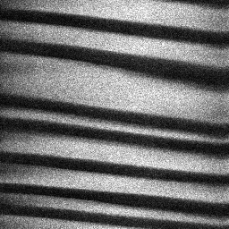
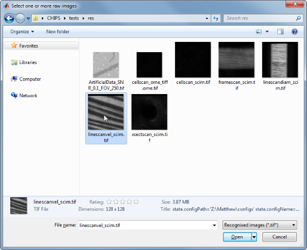
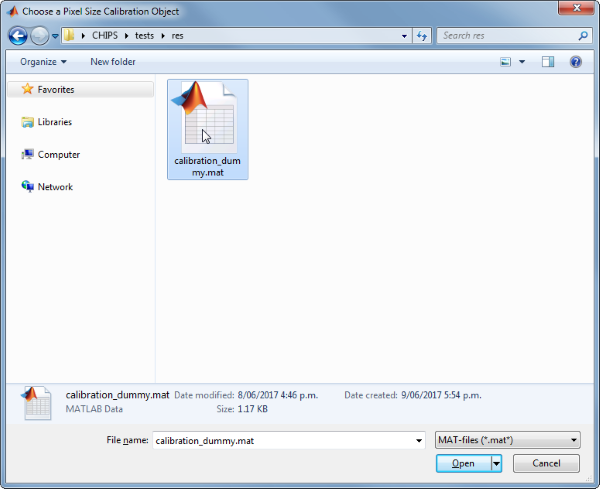
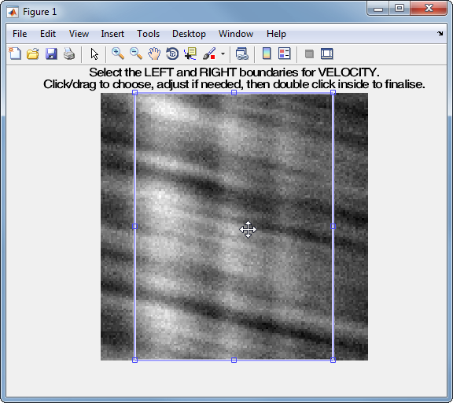
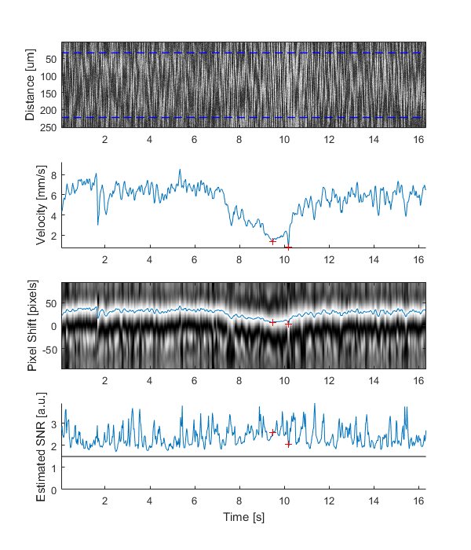
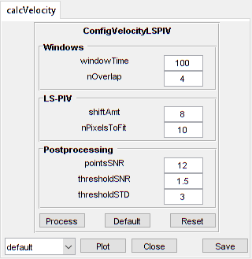

LineScanVel
=======================================

Analyse line scan images of vessel velocities


Usage
----------------------------------------------------------

```matlab
OBJ = LineScanVel(NAME, RAWIMG, CONFIG, ISDS, COLS)
```


Arguments
----------------------------------------------------------

   + `NAME` is the name for this `LineScanVel` object.
   + `RAWIMG` is the `RawImg` object that will be used to create the `LineScanVel` object.
   + `CONFIG` contains the configuration parameters needed for the `calcVelocity` object.
   + `ISDS` specifies whether the streaks to analyse are dark (i.e. negatively labelled) or bright (i.e. positively labelled).
   + `COLS` specifies the left and right columns that will form the edges of the `RawImg` data to use in the calculation.


Details
----------------------------------------------------------

`LineScanVel` objects are used to analyse the velocity from line scan images acquired by scanning along to the vessel axis.  Typically, the blood plasma will be labelled by a fluorescent marker, like a dextran conjugated fluorophore (e.g. FITC, as in the figure below), but the method also works with labelled red blood cells (RBCs).





See Also
----------------------------------------------------------

   + [`LineScanVel` class documentation](matlab:doc('LineScanVel'))
   + [`ConfigVelocityRadon` class documentation](matlab:doc('ConfigVelocityRadon'))
   + [`ConfigVelocityLSPIV` class documentation](matlab:doc('ConfigVelocityLSPIV'))
   + [`CalcVelocityRadon` class documentation](matlab:doc('CalcVelocityRadon'))
   + [`CalcVelocityLSPIV` class documentation](matlab:doc('CalcVelocityLSPIV'))
   + [`ImgGroup` class documentation](matlab:doc('ImgGroup'))
   + [`ImgGroup` quick start guide](./ig_ImgGroup.html)


Examples
----------------------------------------------------------

The following examples require the sample images and other files, which can be downloaded manually, from the University of Zurich website ([http://www.pharma.uzh.ch/en/research/functionalimaging/CHIPS.html](http://www.pharma.uzh.ch/en/research/functionalimaging/CHIPS.html)), or automatically, by running the function `utils.download_example_imgs()`.

<h3>Create a <tt>LineScanVel</tt> object interactively</h3>

The following example will illustrate the process of creating a `LineScanVel` object interactively, starting with calling the constructor.

```matlab
% Call the LineScanVel constructor
lsv01 = LineScanVel()
```
Since no RawImg has been specified, the first stage is to select the type of RawImg to create.  Press three and then enter to select the SCIM_Tif.


```text
----- What type of RawImg would you like to load? -----
```

```text
  >> 1) BioFormats
     2) RawImgDummy
     3) SCIM_Tif
```

```text
Select a format: 3
```
Then, use the interactive dialogue box to select the raw image file `linescanvel_scim.tif`, which should be located in the subfolder tests>res, within the CHIPS root directory.





A warning may appear about the pixel aspect ratio, but this is not relevant for `LineScanVel` images.

Use the interactive dialogue box to select the dummy calibration (`calibration_dummy.mat`):





The next stage is to define the 'meaning' of the image channels.  The first channel represents the blood plasma.  Press one and then enter to complete the selection.


```text
----- What is shown on channel 1? -----
```

```text
  >> 0) <blank>
     1) blood_plasma
     2) blood_rbcs
```

```text
Answer: 1
```
The next stage is to specify which velocity calculation algorithm should be used. In this case we will choose the Radon transform method.  Press two and then enter to complete the selection


```text
----- What type of velocity calculation would you like to use? -----
```

```text
  >> 1) CalcVelocityLSPIV
     2) CalcVelocityRadon
```

```text
Select a format: 2
```
The final stage is to select the left and right limits of the image to use for velocity calculations.  This can be useful to exclude the edges where there can be artefacts associated with the scan mirrors changing speed and/or direction.





We have now created a `LineScanVel` object interactively.


```text
lsv01 =
```

```text
  LineScanVel with properties:
```

```text
        plotList: [1x1 struct]
    calcVelocity: [1x1 CalcVelocityRadon]
    colsToUseVel: [17 112]
   isDarkStreaks: 1
           state: 'unprocessed'
            name: 'linescanvel_scim'
          rawImg: [1x1 SCIM_Tif]
```
The process is almost exactly the same to create an array of `LineScanVel` objects; when the software prompts you to select one or more raw images, simply select multiple images by using either the shift or control key.

<h3>Prepare a <tt>RawImg</tt> for use in these examples</h3>

```matlab
% Prepare a rawImg for use in these examples
fnRawImg = fullfile(utils.CHIPS_rootdir, 'tests', 'res', ...
    'linescanvel_scim.tif');
channels = struct('blood_plasma', 1);
fnCalibration = fullfile(utils.CHIPS_rootdir, 'tests', 'res', ...
    'calibration_dummy.mat');
calibration = CalibrationPixelSize.load(fnCalibration);
rawImg = SCIM_Tif(fnRawImg, channels, calibration);
```

```text
Opening linescanvel_scim.tif: 100% [===============================]

```
<h3>Create a <tt>LineScanVel</tt> object without any interaction</h3>

```matlab
% Create a LineScanVel object without any interaction
nameLSV02 = 'test LSV 02';
configRadon = ConfigVelocityRadon();
isDarkStreaks = [];
colsToUse = [17 112];
lsv02 = LineScanVel(nameLSV02, rawImg, configRadon, ...
    isDarkStreaks, colsToUse)
```

```text
lsv02 =
  LineScanVel with properties:

         plotList: [1×1 struct]
     calcVelocity: [1×1 CalcVelocityRadon]
     colsToUseVel: [17 112]
    isDarkStreaks: 1
            state: 'unprocessed'
             name: 'test LSV 02'
           rawImg: [1×1 SCIM_Tif]

```
<h3>Create a <tt>LineScanVel</tt> object array</h3>

```matlab
% Create the RawImg array first
rawImgArray(1:3) = copy(rawImg);
rawImgArray = copy(rawImgArray)
```

```text
rawImgArray =
  1×3 SCIM_Tif array with properties:

    filename
    isDenoised
    isMotionCorrected
    metadata_original
    name
    rawdata
    t0
    metadata


```
```matlab
% Then create a LineScanVel object array
lsvArray = LineScanVel('test LSV Array', rawImgArray, configRadon, ...
    isDarkStreaks, colsToUse)
```

```text
lsvArray =
  1×3 LineScanVel array with properties:

    plotList
    calcVelocity
    colsToUseVel
    isDarkStreaks
    state
    name
    rawImg


```
<h3>Create a <tt>LineScanVel</tt> object with a custom config</h3>

```matlab
% Create a LineScanVel object with a custom config
configLSPIV = ConfigVelocityLSPIV('shiftAmt', 8, 'windowTime', 100, ...
    'thresholdSNR', 1.5);
lsv03 = LineScanVel('test LSV 03', rawImg, configLSPIV, ...
    isDarkStreaks, colsToUse);
confVel = lsv03.calcVelocity.config
```

```text
confVel =
  ConfigVelocityLSPIV with properties:

      windowTime: 100
        nOverlap: 4
        shiftAmt: 8
    nPixelsToFit: 10
       pointsSNR: 12
    thresholdSNR: 1.5000
    thresholdSTD: 3

```
<h3>Process a scalar <tt>LineScanVel</tt> object</h3>

```matlab
% Process a scalar LineScanVel object
lsv03 = lsv03.process();
```

```text
Calculating velocity: 100% [=======================================]

```
<h3>Process a <tt>LineScanVel</tt> object array (in parallel)</h3>

```matlab
% Process a LineScanVel object array (in parallel).
% This code requires the Parallel Computing Toolbox to run in parallel
useParallel = true;
lsvArray = lsvArray.process(useParallel);
lsvArray_state = {lsvArray.state}
```

```text
Processing array: 100% [===========================================]
lsvArray_state =
  1×3 cell array
    'processed'    'processed'    'processed'

```
<h3>Plot a figure showing the output</h3>

```matlab
% Plot a figure showing the output
hFig03 = lsv03.plot();
set(hFig03, 'Position', [50, 50, 600, 700])
```


<h3>Produce a GUI to optimise the parameters</h3>

```matlab
% Produce a GUI to optimise the Radon transform parameters
hFigOpt03 = lsv03.opt_config();
```


<h3>Output the data</h3>

```matlab
% Output the data.  This requires write access to the working directory
fnCSV03 = lsv03.output_data('lsv03', 'overwrite', true);
fID03 = fopen(fnCSV03{1}, 'r');
fileContents03 = textscan(fID03, '%s');
fileContents03{1}{1:5}
fclose(fID03);
```

```text
ans =
    'time,velocity,yPosition,pixelShift,estSNR,maskSNR,maskSTD,mask'
ans =
    '0.050,4.441,NaN,22.739,2.713,FALSE,FALSE,FALSE'
ans =
    '0.075,4.352,NaN,22.285,2.884,FALSE,FALSE,FALSE'
ans =
    '0.100,4.760,NaN,24.371,2.490,FALSE,FALSE,FALSE'
ans =
    '0.125,5.267,NaN,26.966,2.406,FALSE,FALSE,FALSE'

```

---
[Home](./index.html)
